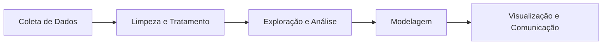

# 🔬 Ciência de Dados com Python

Este repositório apresenta um guia prático de **Ciência de Dados usando Python** e suas principais bibliotecas.  
A ideia é mostrar como instalar o ambiente, manipular dados, realizar análises e criar visualizações de forma simples e didática.

---

## 📌 O que é Ciência de Dados?

Ciência de Dados é a prática de **coletar, organizar, analisar e interpretar dados** para apoiar a tomada de decisão.  
O processo geralmente envolve:

1. **Coleta de dados** – arquivos CSV, bancos de dados, APIs, sensores.  
2. **Limpeza e tratamento** – remoção de inconsistências, tratamento de valores nulos e formatação.  
3. **Exploração e análise** – estatísticas descritivas, padrões e correlações.  
4. **Modelagem** – algoritmos de aprendizado de máquina ou estatísticos.  
5. **Visualização** – gráficos e dashboards para comunicar os resultados.  

---

## ⚙️ Tecnologias Utilizadas

- [Python 3.x](https://www.python.org/)  
- [NumPy](https://numpy.org/) → operações matemáticas e vetorização  
- [Pandas](https://pandas.pydata.org/) → manipulação e análise de dados  
- [Matplotlib](https://matplotlib.org/) → gráficos básicos  
- [Seaborn](https://seaborn.pydata.org/) → gráficos estatísticos estilizados  
- [Scikit-learn](https://scikit-learn.org/) → algoritmos de Machine Learning  
- [SQLAlchemy](https://www.sqlalchemy.org/) → integração com banco de dados  
- [TinyDB](https://tinydb.readthedocs.io/en/latest/) → banco de dados não relacional (JSON)  

---

## 📦 Instalação

Clone este repositório e instale as dependências:

```bash
git clone https://github.com/seu-usuario/ciencia-de-dados-python.git
cd ciencia-de-dados-python

# Crie um ambiente virtual (recomendado)
python -m venv venv
source venv/bin/activate   # Linux/Mac
venv\Scripts\activate      # Windows

# Instale as bibliotecas
pip install -r requirements.txt
```

Se preferir, instale manualmente:

```bash
pip install numpy pandas matplotlib seaborn scikit-learn sqlalchemy tinydb
```

---

## 📂 Estrutura do Projeto

```
├── data/              # Dados brutos e processados
├── notebooks/         # Jupyter Notebooks com exemplos
├── scripts/           # Scripts Python reutilizáveis
├── output/            # Resultados e relatórios
└── README.md          # Documentação do projeto
```

---

## 🚀 Exemplo de Uso

### 1. Importação de bibliotecas
```python
import pandas as pd
import numpy as np
import matplotlib.pyplot as plt
import seaborn as sns
```

### 2. Carregando dados
```python
dados = pd.read_csv("data/vendas.csv")
print(dados.head())
```

### 3. Tratamento e exploração
```python
dados.dropna(inplace=True)  # remove valores nulos
print(dados.describe())
```

### 4. Visualização
```python
sns.barplot(x="categoria", y="receita", data=dados)
plt.show()
```

### 5. Modelagem (exemplo simples)
```python
from sklearn.linear_model import LinearRegression

X = dados[["preco", "quantidade"]]
y = dados["receita"]

modelo = LinearRegression()
modelo.fit(X, y)

print("Coeficientes:", modelo.coef_)
```

---

## 📊 Fluxo de Ciência de Dados



---

## 📜 Licença

Este projeto é de uso **educacional** e livre para estudo.

---

✍️ Desenvolvido como guia introdutório sobre **Ciência de Dados com Python**.
