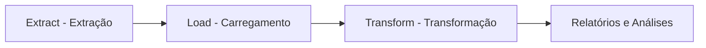

# 📊 Projeto ELT - Loja de Varejo

## 📌 Descrição
Este projeto tem como objetivo aplicar um pipeline de **ELT (Extract, Load, Transform)** para dados de uma loja de varejo.  
A ideia é centralizar os dados, aplicar transformações necessárias e disponibilizar relatórios para facilitar a tomada de decisão no negócio.  

O processo é documentado em um **Jupyter Notebook**, com todas as etapas detalhadas e exemplos de análises que podem ser feitas com os dados tratados.

---

## 📂 Estrutura do Projeto
```
├── ELT-Loja-Varejo.ipynb   # Notebook principal do projeto
├── data/                   # Diretório para armazenar dados brutos
│   ├── vendas.csv          # Exemplo de base de vendas
│   ├── clientes.csv        # Exemplo de base de clientes
│   └── produtos.csv        # Exemplo de base de produtos
├── output/                 # Resultados e transformações geradas
│   ├── vendas_tratadas.csv
│   └── relatorios/
└── README.md               # Documentação do projeto
```

---

## ⚙️ Tecnologias Utilizadas
- **Linguagem:** Python 3.x  
- **Ambiente:** Jupyter Notebook  
- **Bibliotecas principais:**  
  - `pandas` → manipulação e análise de dados  
  - `numpy` → operações matemáticas e numéricas  
  - `sqlalchemy` → integração com banco de dados (se aplicável)  
  - `matplotlib` / `seaborn` → geração de gráficos  
  - `os` e `pathlib` → manipulação de arquivos e diretórios  

---

## ▶️ Como Executar
1. Clone este repositório:
   ```bash
   git clone https://github.com/seu-usuario/elt-loja-varejo.git
   cd elt-loja-varejo
   ```

2. Crie e ative um ambiente virtual:
   ```bash
   python -m venv venv
   source venv/bin/activate   # Linux/Mac
   venv\Scripts\activate    # Windows
   ```

3. Instale as dependências:
   ```bash
   pip install -r requirements.txt
   ```

4. Abra o Jupyter Notebook:
   ```bash
   jupyter notebook
   ```

5. Execute o arquivo `ELT-Loja-Varejo.ipynb`.

---

## ⚡ Explicação do Código

O notebook segue as três etapas do processo **ELT**:

### 1. Importação de Bibliotecas
Carregamos as principais bibliotecas como `pandas`, `numpy` e ferramentas para leitura e escrita de dados.

### 2. Extract (Extração)
Leitura de dados brutos (CSV, Excel ou banco de dados) para DataFrames.

### 3. Load (Carregamento)
Armazenamento em camadas intermediárias, podendo salvar em formatos como CSV, Parquet ou em banco de dados.

### 4. Transform (Transformação)
- Limpeza de dados (remoção de nulos e duplicados)  
- Padronização de colunas (datas, categorias)  
- Cálculo de métricas derivadas, como **Receita Total** e **Ticket Médio**  
- Junção entre tabelas de vendas, clientes e produtos  

### 5. Análises
- Produtos mais vendidos  
- Receita por período  
- Top clientes por faturamento  
- Desempenho por categoria de produto  

### 6. Visualizações
Gráficos e tabelas para facilitar a interpretação dos resultados.

---

## 📈 Fluxo ELT



---

## 📊 Exemplos de Análises
- **Faturamento por período:** identificar sazonalidades (ex.: meses de maior venda).  
- **Produtos mais vendidos:** ranking de produtos com maior receita.  
- **Clientes mais valiosos:** análise de clientes que mais compram.  
- **Desempenho por categoria:** comparação entre linhas de produto.  

---

## 🚀 Próximos Passos
- Automatizar o pipeline de ELT com **Airflow** ou **Prefect**  
- Armazenar dados tratados em um **Data Warehouse** (ex.: BigQuery, Snowflake)  
- Criar dashboards interativos em **Power BI** ou **Tableau**  

---

## 🧑‍💻 Autor
- **Seu Nome**  
📧 Email: seuemail@exemplo.com  
🔗 [LinkedIn](https://linkedin.com/in/seuusuario)  
🔗 [GitHub](https://github.com/seu-usuario)
